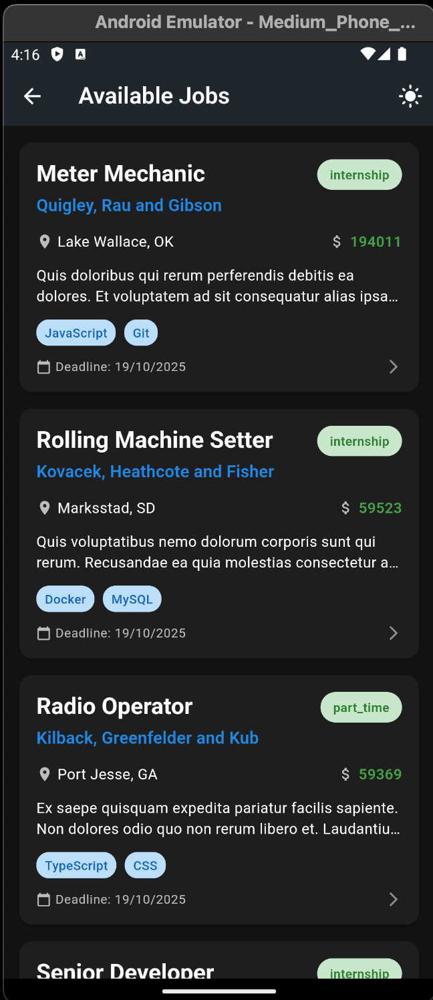
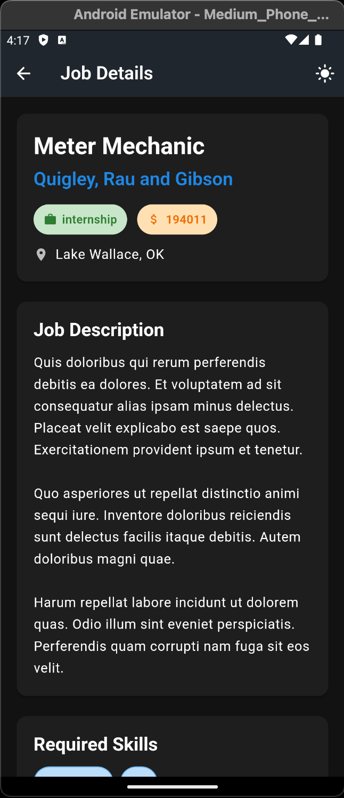
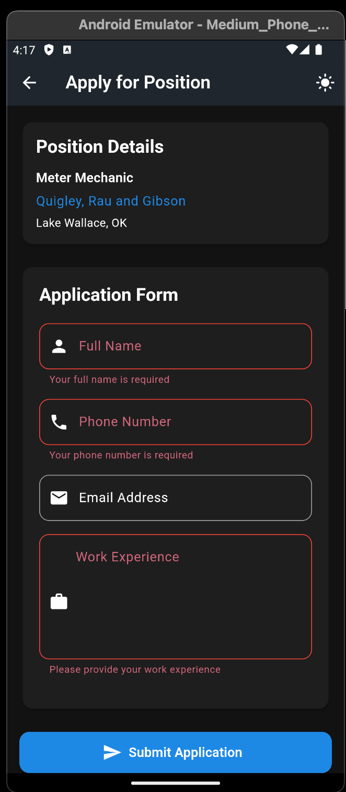

# Job Posting Flutter App

A comprehensive Flutter application for browsing and applying to job postings. This app features dark/light theme switching, job listing, detailed job views, and an application submission system.

## Features

- **Dark/Light Theme Toggle** - Switch between themes with persistent settings
- **Job Listings** - Browse available job opportunities 
- **Job Details** - View comprehensive job information including requirements
- **Application Form** - Submit job applications with form validation
- **Modern UI** - Clean, responsive design with Material Design principles
- **Real-time Updates** - Pull-to-refresh functionality
- **Fast Performance** - Built with GetX for state management

## Screenshots

> **Add your app screenshots here!**
> 
> You can add screenshots by:
> 1. Creating a `screenshots/` folder in the project root
> 2. Adding your screenshot images (PNG/JPG format)
> 3. Updating this section with image references like:
> 
> ```markdown
> ### Home Screen
> 
> 
> ### Job List
> 
> 
> ### Job Details
> 
> 
> ### Application Form
> 
> ```

## Prerequisites

- **Flutter SDK**: Version 3.24.3 or compatible
- **FVM (Flutter Version Management)**: Recommended for version control
- **Laravel Backend API**: Running on your local network
- **Android Studio / VS Code**: For development
- **Physical device or emulator**: For testing

## Installation & Setup

### 1. Clone the Repository

```bash
git clone https://github.com/MirulHan/job_posting_flutter_app.git
cd job_posting_flutter_app
```

### 2. Flutter Version Management

#### Option A: Using FVM (Recommended)
```bash
# Install FVM if you haven't already
dart pub global activate fvm

# Use the specified Flutter version
fvm use
```

#### Option B: Using Flutter Directly
```bash
# Ensure you have Flutter 3.24.3 installed
flutter --version
# If you need to install/switch to Flutter 3.24.3, follow the Flutter documentation
```

### 3. Install Dependencies

```bash
# If using FVM
fvm flutter pub get

# If using Flutter directly
flutter pub get
```

### 4. Backend API Setup

Make sure your Laravel backend API is running:

```bash
# In your Laravel project directory
php artisan serve --host=0.0.0.0 --port=8000
```

**Important**: Use `--host=0.0.0.0` to make the API accessible from other devices on your network.

### 5. Configure API Endpoint

1. Locate the `.env` file in the project root
2. Update the API base URL with your machine's IP address:

```env
# Example - Replace with your actual IP address
API_BASE_URL=http://192.168.1.100:8000/api

# To find your IP address:
# Windows: ipconfig
# macOS/Linux: ifconfig or ip addr show
```

### 6. Run the Application

```bash
# If using FVM
fvm flutter run

# If using Flutter directly
flutter run
```

## Project Structure

```
lib/
├── controllers/          # GetX controllers for state management
│   ├── application_controller.dart
│   ├── job_controller.dart
│   └── theme_controller.dart
├── core/                 # Core app configuration
│   └── app.dart
├── models/              # Data models
│   ├── api_response_model.dart
│   ├── job.dart
│   └── post.dart
├── screens/             # UI screens
│   ├── home_screen.dart
│   ├── job_list_screen.dart
│   ├── job_detail_screen.dart
│   ├── job_application_screen.dart
│   └── api_demo_screen.dart
├── services/            # API services
│   └── api_service.dart
├── widgets/             # Reusable widgets
│   └── primary_layout.dart
└── main.dart           # App entry point
```

## API Endpoints

The app expects the following Laravel API endpoints:

- `GET /api/job-posts` - Retrieve all job postings
- `GET /api/job-posts/{id}` - Retrieve specific job posting
- `POST /api/job-applications` - Submit job application

### Expected API Response Format

#### Job Posts Response
```json
{
  "data": [
    {
      "id": 1,
      "title": "Frontend Developer",
      "description": "Job description...",
      "company": "Tech Solutions Inc.",
      "location": "New York, NY",
      "job_type": "Full-time",
      "salary": "85000.00",
      "contact_email": "careers@techsolutions.com",
      "skills": ["React", "JavaScript", "CSS"],
      "application_deadline": "2025-10-18",
      "is_active": true,
      "created_at": "2025-09-18 19:59:55",
      "updated_at": "2025-09-18 19:59:55"
    }
  ]
}
```

#### Application Submission
```json
// Request
{
  "job_post_id": 1,
  "full_name": "John Doe",
  "phone_number": "123-456-7890",
  "email": "john@example.com",
  "work_experience": "5 years of experience..."
}

// Success Response
{
  "message": "Application submitted successfully"
}

// Error Response
{
  "message": "Validation errors",
  "errors": {
    "full_name": ["Full name is required"],
    "email": ["Email is required"]
  }
}
```

## Troubleshooting

### Common Issues

1. **API Connection Issues**
   - Ensure your Laravel API is running
   - Check that the IP address in `.env` is correct
   - Verify both devices are on the same network

2. **Flutter Version Issues**
   - Use FVM for consistent Flutter version management
   - Run `flutter doctor` to check for issues

3. **Build Issues**
   - Run `flutter clean` then `flutter pub get`
   - Check for any dependency conflicts

### Network Configuration

If testing on a physical device:
- Ensure your computer and mobile device are on the same Wi-Fi network
- Disable any firewall that might block port 8000
- Use your computer's local IP address (not localhost or 127.0.0.1)

## Development

### State Management
This project uses **GetX** for:
- State management
- Dependency injection
- Route management
- Reactive programming

### Theme Management
- Light and dark themes are defined in `lib/core/app.dart`
- Theme switching is handled by `ThemeController`
- Theme preference persistence (when storage is available)

### Error Handling
- Backend validation errors are displayed on form fields
- Network errors show user-friendly messages
- Loading states provide visual feedback
